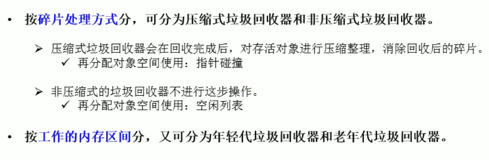

### 垃圾回收器

垃圾回收器分类  
  
  
  
  

### 评估垃圾回收器的性能指标  
  

吞吐量  
  
暂停时间  
  
吞吐量与暂停时间对比  
  
  

垃圾回收器发展史  
  

7款经典垃圾回收器  
  

垃圾收集器的组合关系(jdk8中取消了红色虚线组合，但是仍然能用，jdk中移除，不能再用；jdk9取消了绿色，但是能用)  
  
  

查看默认垃圾回收器参数  
  

### Serial回收器-串行回收
  
  
  
  

### ParNew回收器-并行回收

  
  
  

### ParallelScavenge回收器-吞吐量优先

  
  
  
  
  
  

### CMS回收器-低延迟

CMS回收器工作原理  
  
  
  
CMS回收器  
  
CMS回收器优缺点  
  

小结  
  
  

### G1回收器-区域化分代

