### 标记阶段

垃圾标记阶段-对象存活判断  
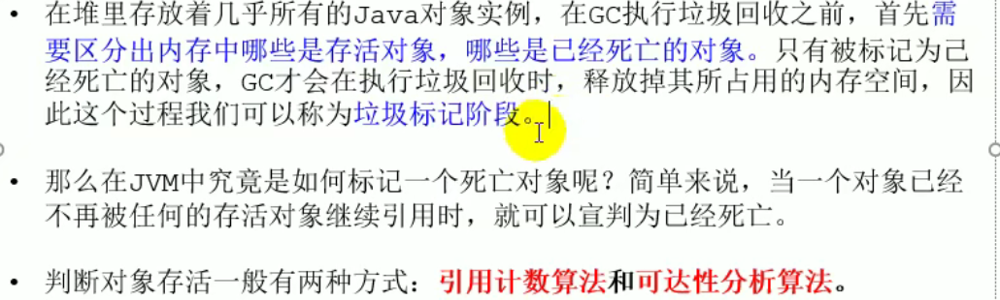  

引用计数法（java并没有使用）  
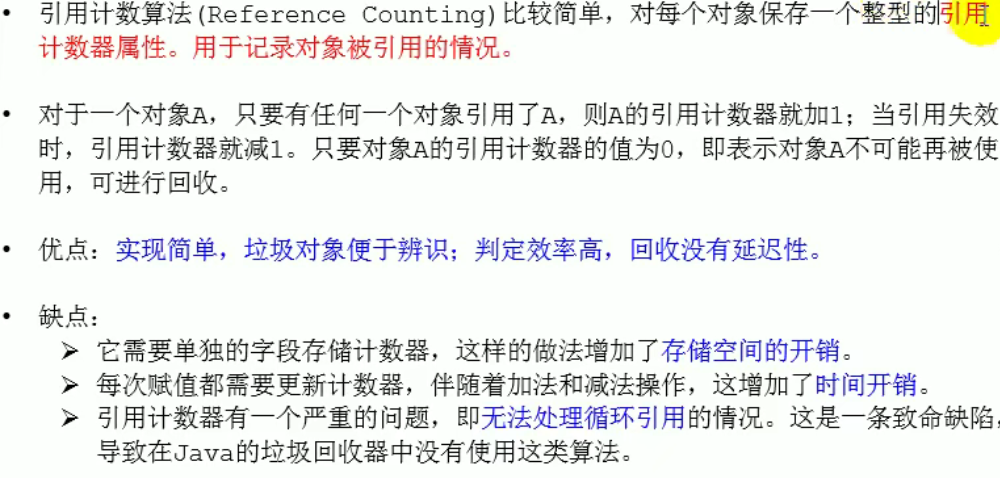  

可达性分析  
  
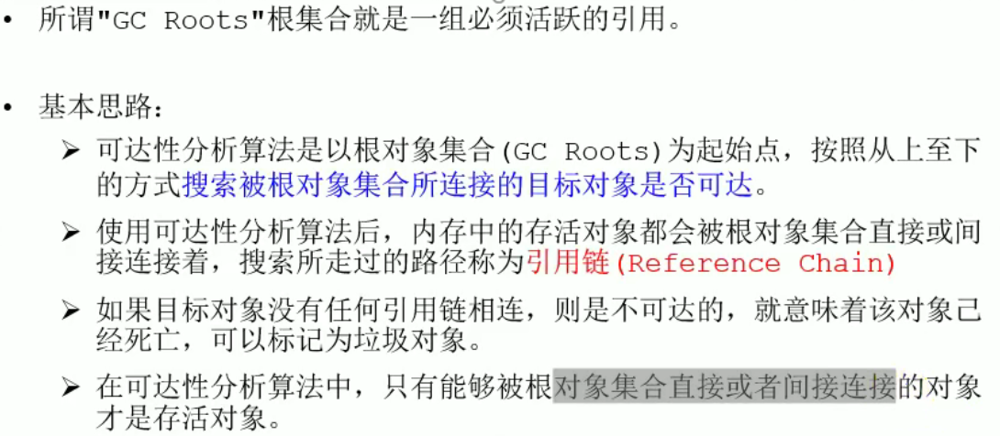  
GCRoots包括  
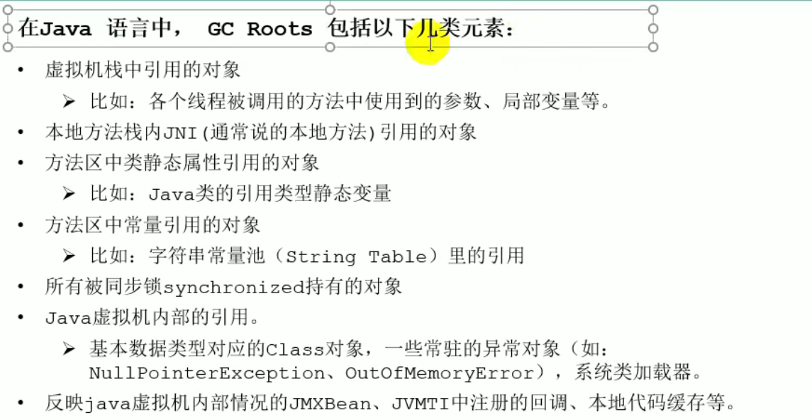  
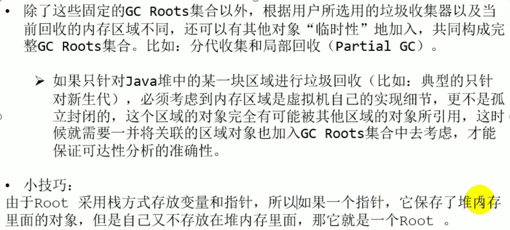  
可达性分析注意  
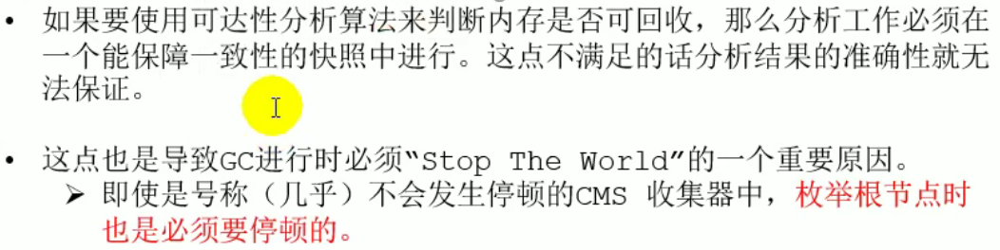  

finalization机制  
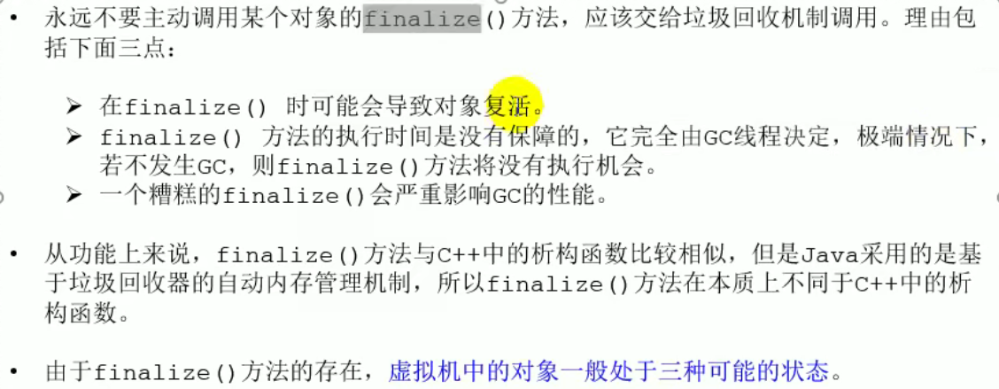  

对象状态  
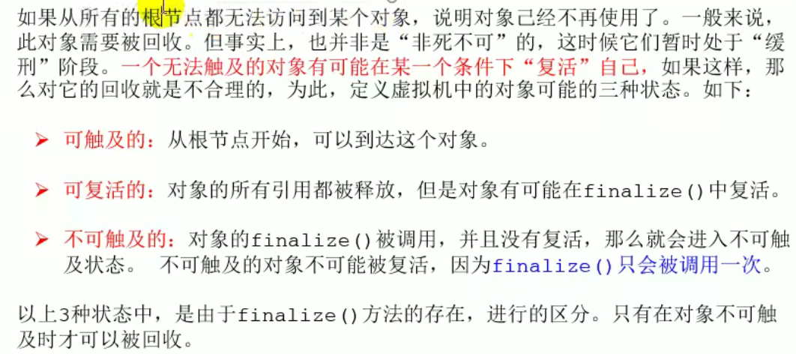  

判断是否可回收具体过程  
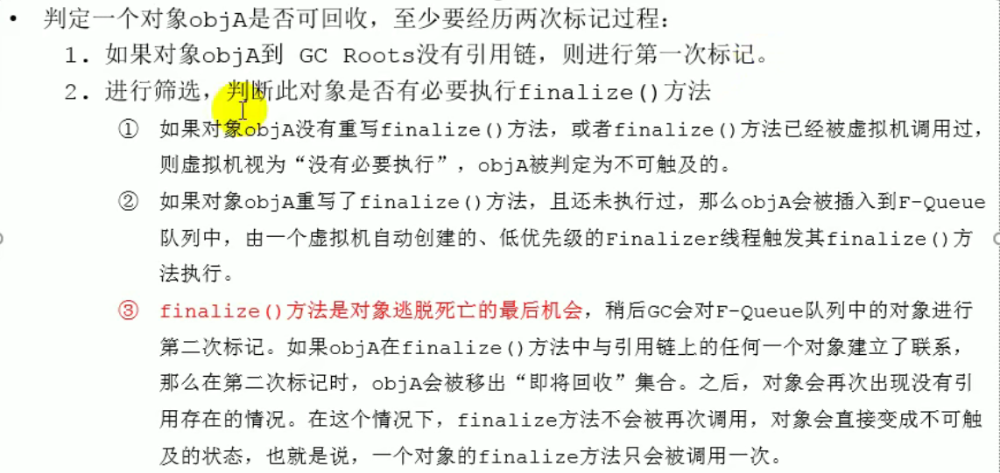   

### 清除阶段

清除阶段概述  
  

mark-sweep概述  
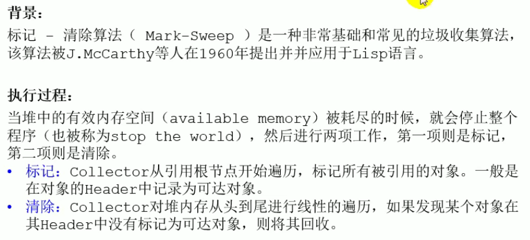  
  

mark-sweep优缺点  
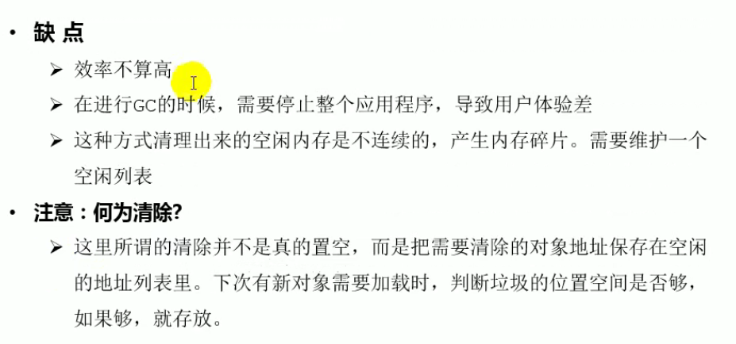

复制算法  
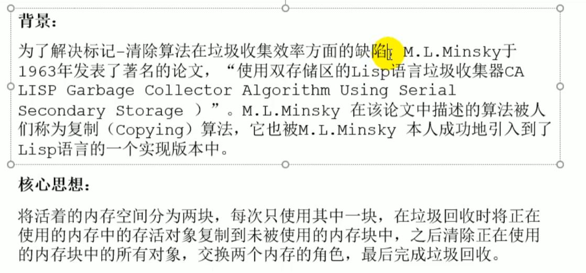  
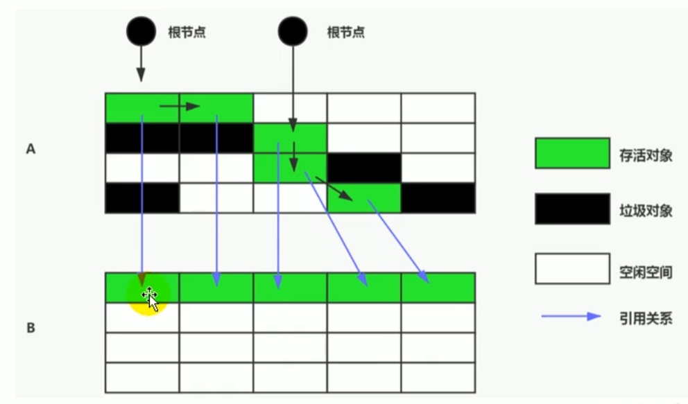  

复制算法优缺点  
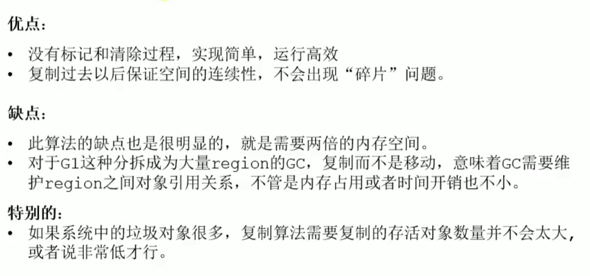  

复制算法应用场景  
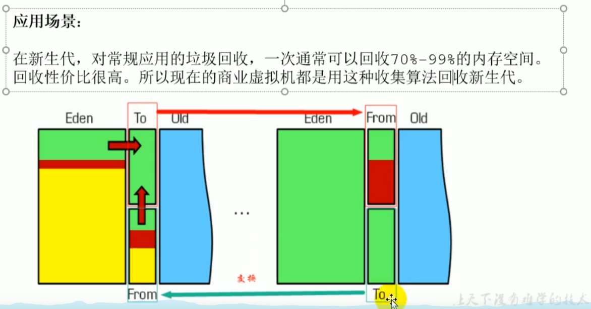  

mark-compact算法(标记-整理)  
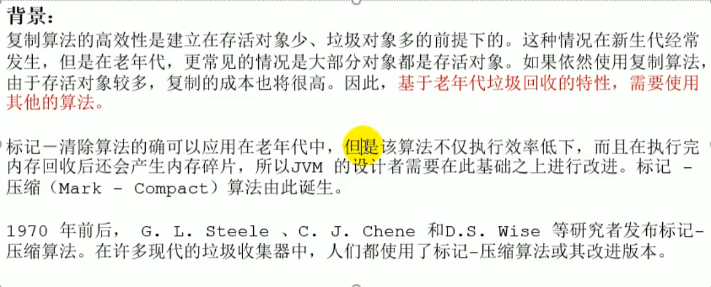  

mark-compact算法执行过程  
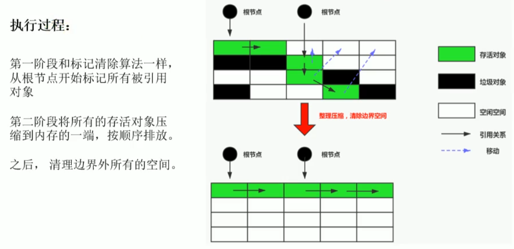  
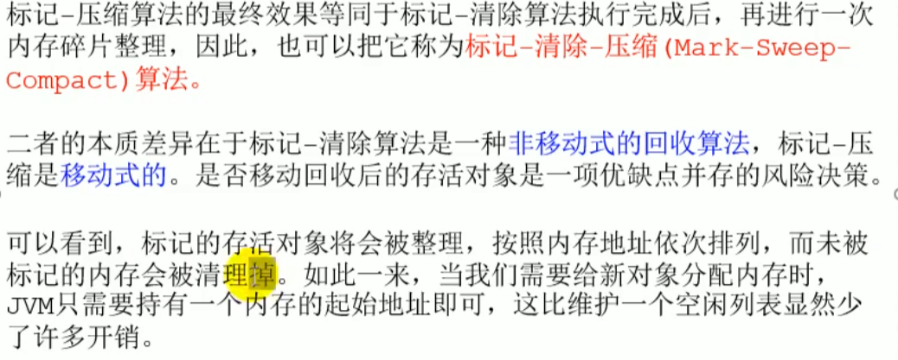  

mark-compact算法优缺点  
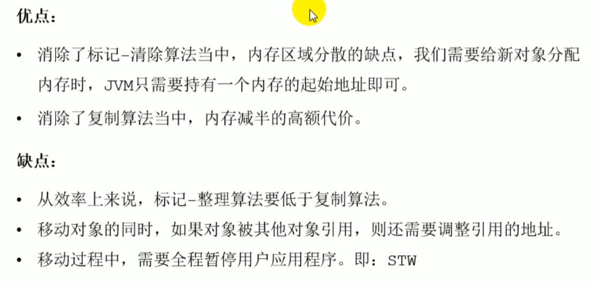  

三种算法小结  
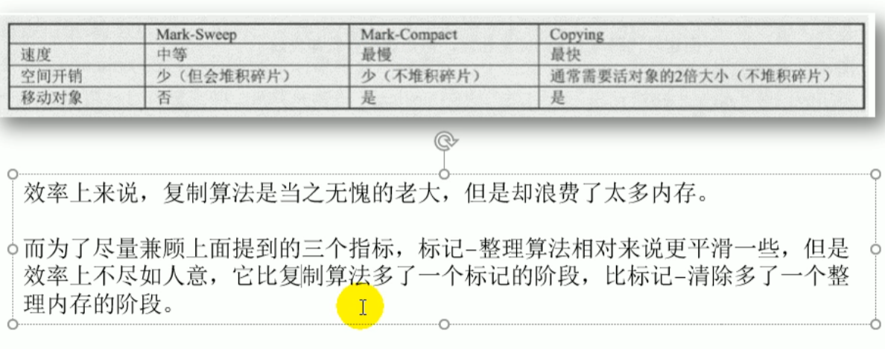  

分带收集算法(并不是一种算法，而是在不同场景分别采用上述三种算法)  
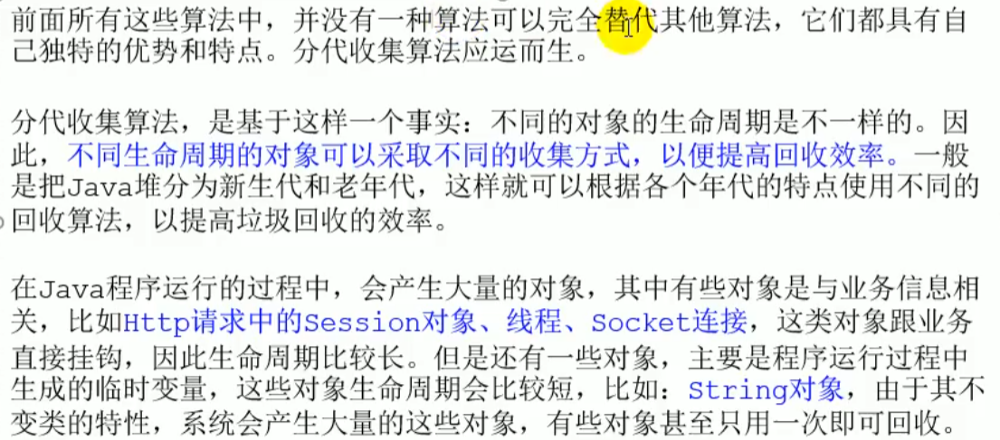  
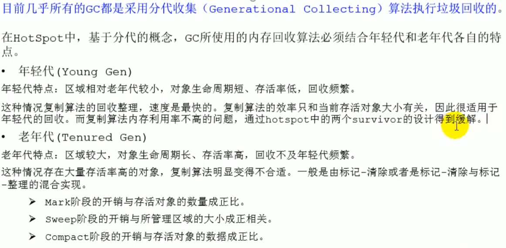  

CMS概述  
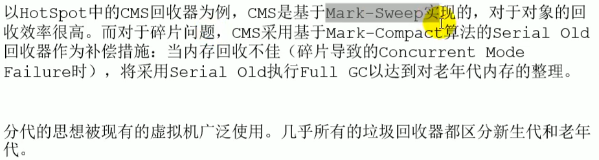  

增量收集算法  
  
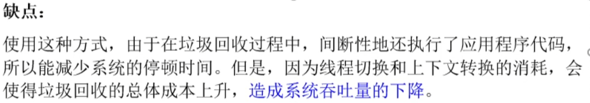  

分区算法  
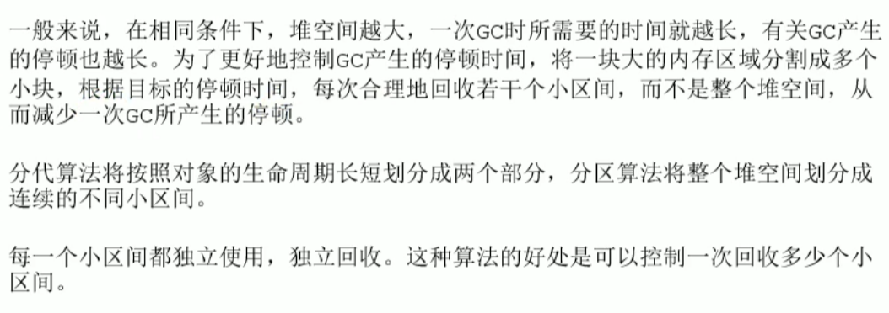
