### 堆

概述

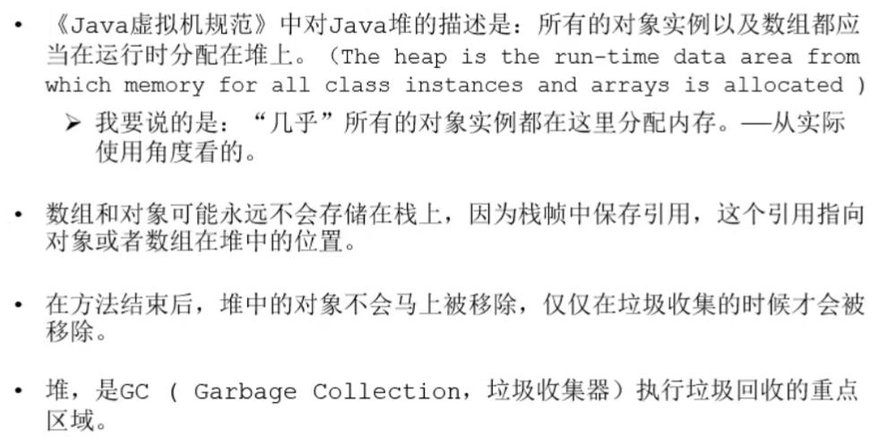

堆内存细分
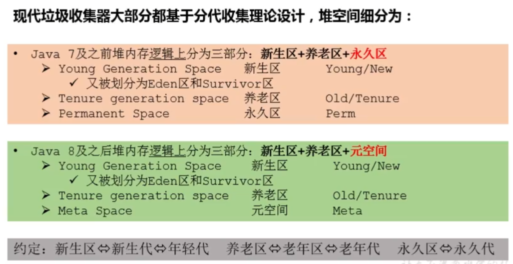

年轻代与老年代
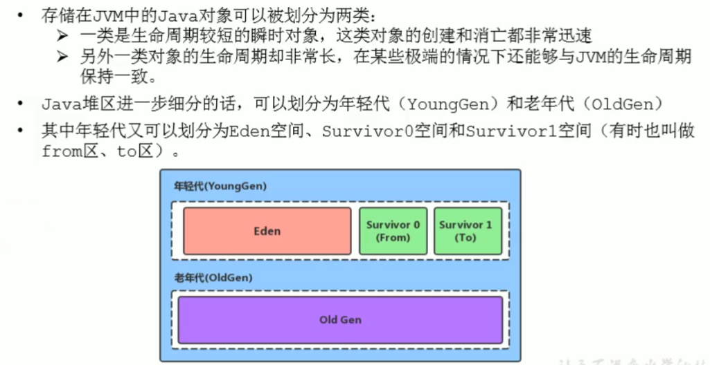
年轻代与老年代占比调整参数
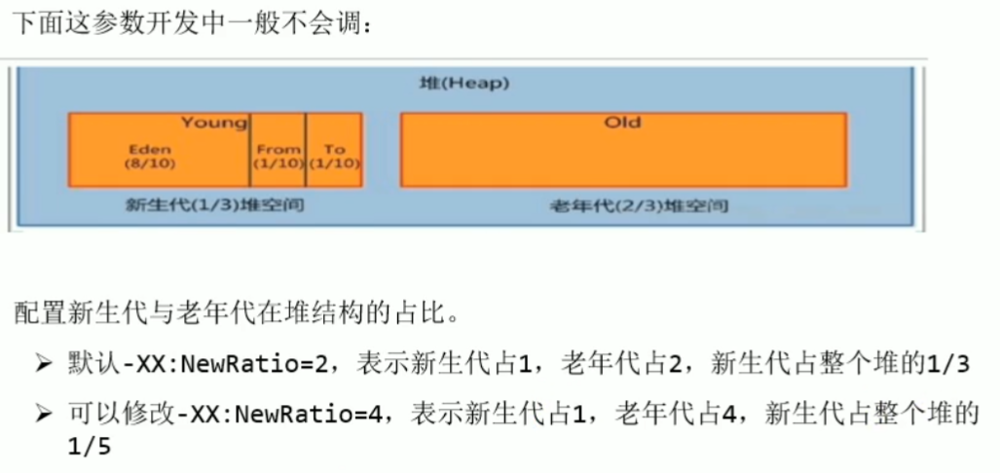

内存分配过程概述
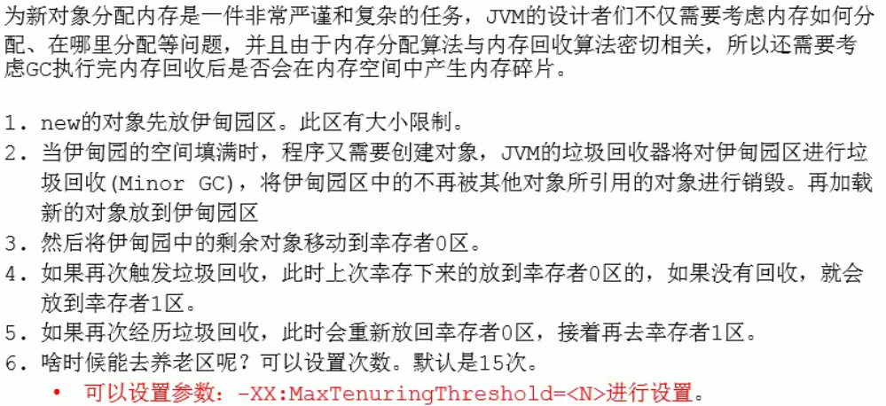
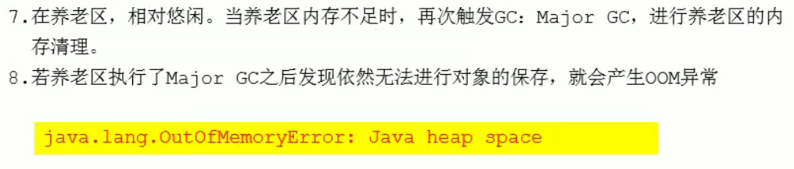

内存分配流程图
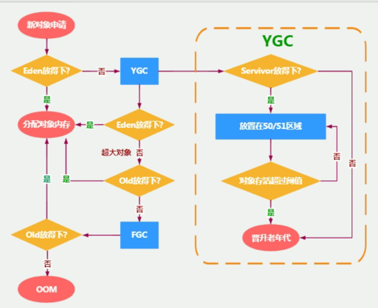

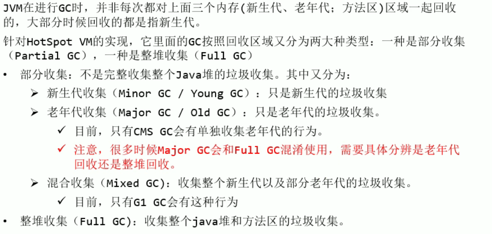

MinorGc
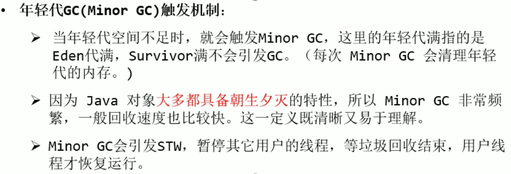

老年代GC
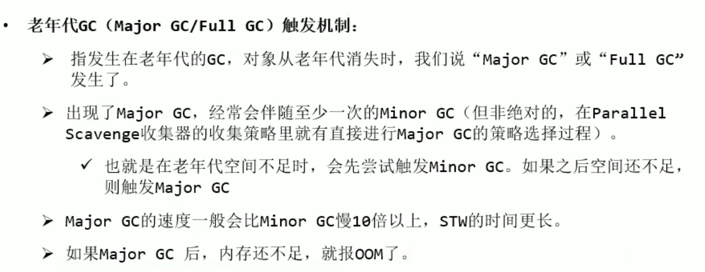

FullGc
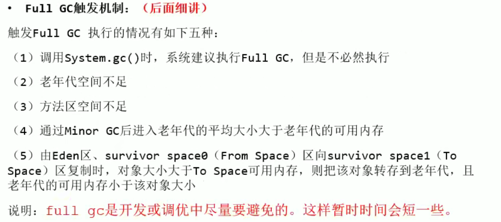

TLAB

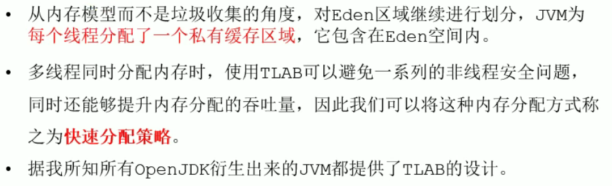
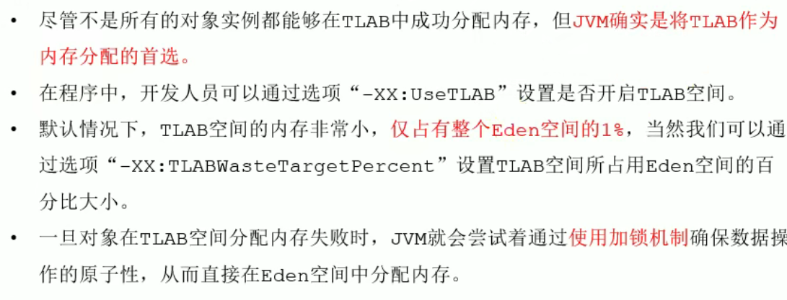

[堆空间参数设置小结](https://www.bilibili.com/video/BV1PJ411n7xZ?p=81&spm_id_from=pageDriver)
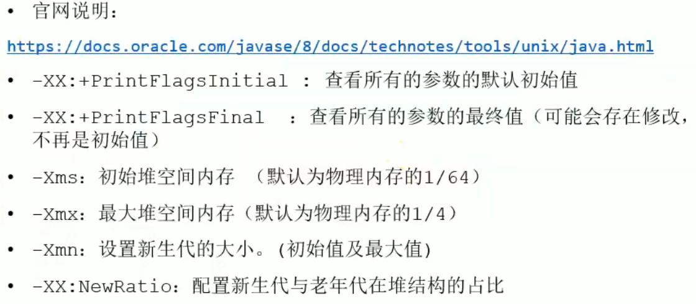

逃逸分析参数设置
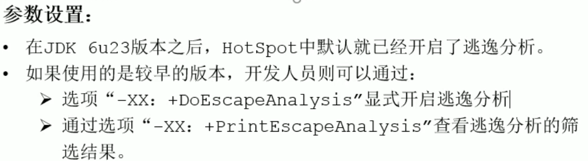

逃逸分析代码优化
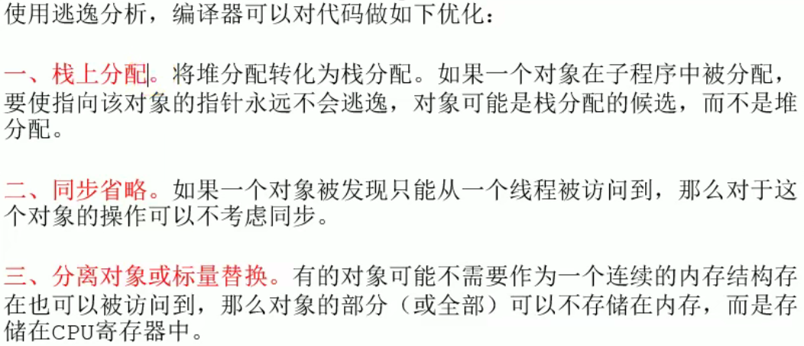

标量替换
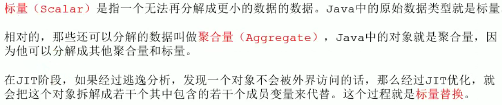

逃逸分析并不成熟
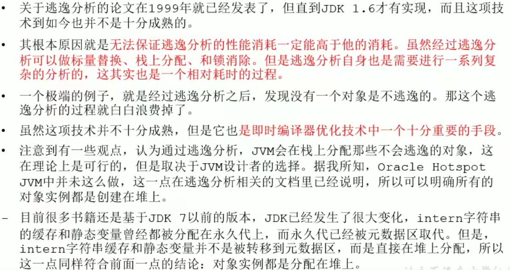

小结
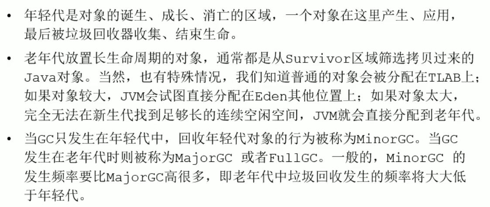