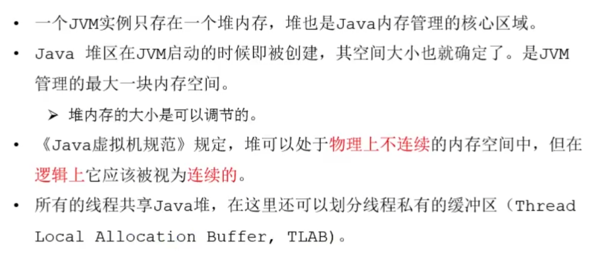

### 堆

概述

堆内存细分

年轻代与老年代

年轻代与老年代占比调整参数

内存分配过程概述

内存分配流程图

MinorGc

老年代GC

FullGc

TLAB

[堆空间参数设置小结](https://www.bilibili.com/video/BV1PJ411n7xZ?p=81&spm_id_from=pageDriver)

逃逸分析参数设置

逃逸分析代码优化

标量替换

逃逸分析并不成熟

小结
