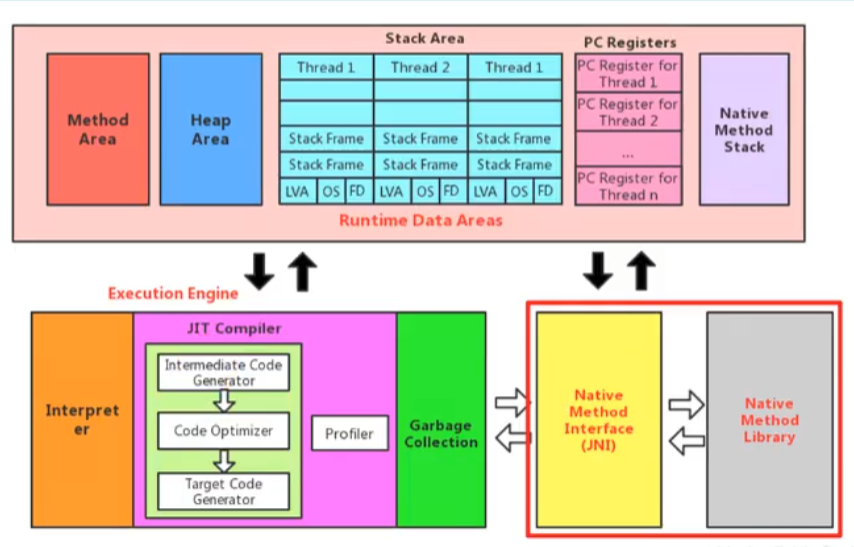

### Java虚拟机栈
- 每个线程在创建时都会创建一个虚拟机栈，其内部保存一个个的栈帧，对应着一次次的Java方法调用
- 是线程私有的
- 主管Java程序的运行，它保存方法的局部变量、部分结果、并参与方法的调用和返回

JvmStackTest

栈帧内部结构

局部变量表

Slot(局部变量槽)

动态链接

动态链接与静态链接

[早期绑定与晚期绑定](https://www.bilibili.com/video/BV1PJ411n7xZ?p=56&spm_id_from=pageDriver)

方法调用:虚方法与非虚方法

[示例](https://www.bilibili.com/video/BV1PJ411n7xZ?p=57&spm_id_from=pageDriver)

### 相关面试题
