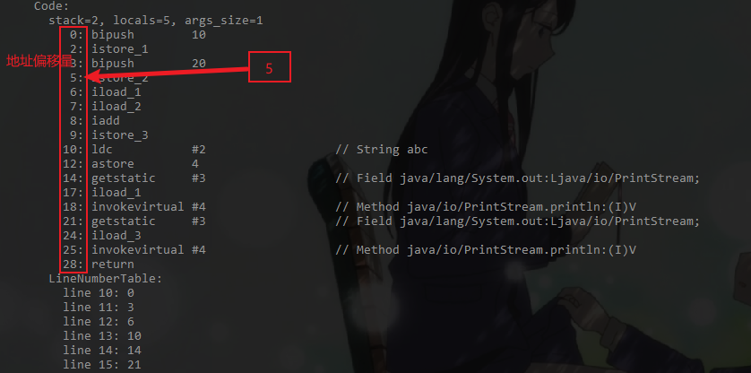

#### 程序计数器
- 它是一块很小的内存空间，几乎可以忽略不计。也是运行速度最快的存储区域
- 在jvm规范中，每个线程都有它自己的程序计数器，是线程私有的，生命周期与线程的生命周期保持一致
- 任何时间一个线程都只有一个方法在执行，也就是所谓的当前方法。程序计数器会存储当前线程正在执行的java方法的JVM指令地址；或者，如果实在执行native方法，则是未指定值（undefined）,因为程序计数器不负责本地方法栈。
- 它是程序控制流的指示器，分支、循环、跳转、异常处理、线程恢复等基础功能都需要依赖这个计数器来完成
- 字节码解释器工作时就是通过改变这个计数器的值来选取吓一跳需要执行的字节码指令
- 它是唯一一个在java虚拟机规范中没有规定任何OOM（Out Of Memory）情况的区域,而且没有垃圾回收